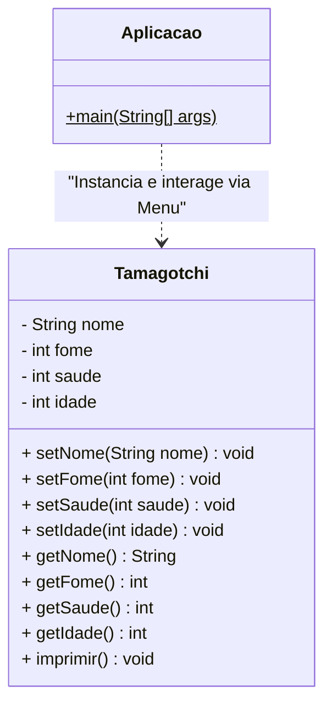

# 🐾 Simulador de Tamagotchi em Java


## Sobre o Projeto

Este repositório contém a implementação de um simulador de **Tamagotchi (Bichinho Eletrônico)** rodando via terminal (CLI). Foi desenvolvido como atividade acadêmica para demonstrar a aplicação dos pilares da Orientação a Objetos (POO) em Java, como **Encapsulamento** e **Responsabilidade Única**.

O sistema modela o estado do pet virtual (Nome, Fome, Saúde e Idade) e protege essas informações através de regras de negócio internas, impedindo estados inválidos (como fome negativa ou idade acima do limite).

### Funcionalidades

* Criação de múltiplas instâncias (2 Tamagotchis simultâneos).
* Menu interativo via console para interagir com os pets.
* Escolha dinâmica de qual Tamagotchi alimentar, curar ou envelhecer.
* Validação de dados em tempo real (Setters inteligentes).
* Impressão formatada do status dos bichinhos.
## Arquitetura e Modelagem

O projeto foi estruturado separando o domínio da aplicação (regras do Tamagotchi) da camada de visualização/interação (classe `Main` interativa).



## Estrutura de Pacotes

```plaintext
src/
└── io/
    └── github/
        └── leandrofariasfl/
            └── tamagotchi/
                ├── Main.java         # Ponto de entrada e menu interativo (Loop)
                └── Tamagotchi.java   # Classe de domínio com as regras de negócio
```

## Como Executar

### Pré-requisitos

* [Java JDK 11+](https://www.oracle.com/java/technologies/downloads/) instalado na máquina.
### Passos

1. Clone este repositório:
```bash
git clone https://github.com/leandrofariasfl/tamagotchi-java-poo.git
```

2. Navegue até a pasta do código-fonte:
```bash
cd tamagotchi-java-poo/src
```

3. Compile os arquivos Java:
```bash
javac io/github/leandrofariasfl/tamagotchi/*.java
```

4. Execute a aplicação (o menu interativo será aberto no terminal):
```bash
java io.github.leandrofariasfl.tamagotchi.Main
```

## 👨‍💻 Autoria e Atribuição

Desenvolvido por **Leandro Farias**

* **Instituição:** UNIT
* **Curso:** Sistemas de Informação |
* **Disciplina:** Backend |
* **Contato:** [Linkedin](https://www.linkedin.com/in/leandro-limafl) |
  Este projeto está sob a licença [MIT](LICENSE) - sinta-se à vontade para usá-lo e modificá-lo.